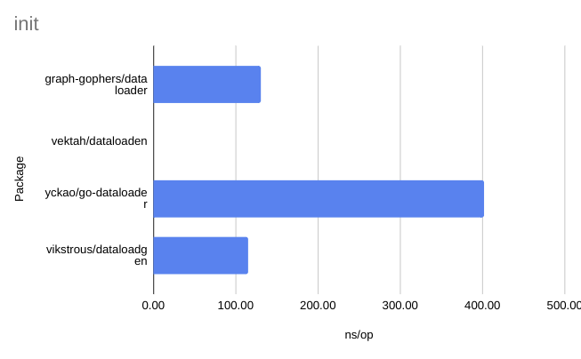
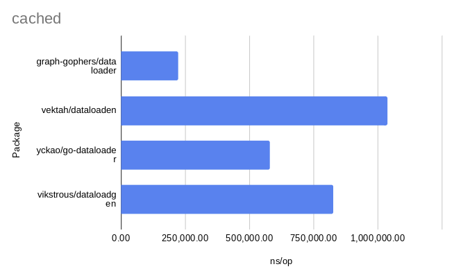
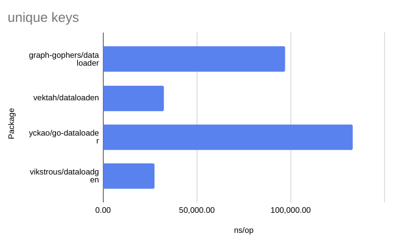
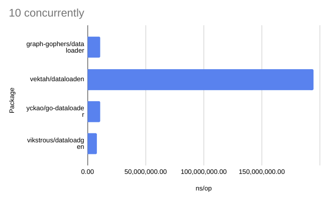
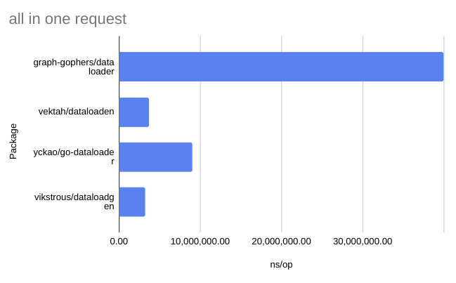

# dataloadgen

[](https://pkg.go.dev/github.com/vikstrous/dataloadgen)

`dataloadgen` is an implementation of a pattern popularized by [Facebook's DataLoader](https://github.com/graphql/dataloader).

It works as follows:
* A Loader object is created per graphql request.
* Each of many concurrently executing graphql resolver functions call Load() on the Loader object with different keys. Let's say K1, K2, K3
* Each call to Load() with a new key is delayed slightly (a few milliseconds) so that the Loader can load them together.
* The customizable fetch function of the loader takes a list of keys and loads data for all of them in a single batched request to the data storage layer. It might send `[K1,K2,K3]` and get back `[V1,V2,V3]`.
* The Loader takes care of sending the right result to the right caller and the result is cached for the duration of the graphql request.

Usage:

```sh
go get github.com/vikstrous/dataloadgen
```

See the usage [example](https://pkg.go.dev/github.com/vikstrous/dataloadgen#example-Loader) in the documentation:
```go
package main

import (
	"context"
	"fmt"
	"strconv"
	"time"

	"github.com/vikstrous/dataloadgen"
)

// fetchFn is shown as a function here, but it might work better as a method
// ctx is the context from the first call to Load for the current batch
func fetchFn(ctx context.Context, keys []string) (ret []int, errs []error) {
    for _, key := range keys {
        num, err := strconv.ParseInt(key, 10, 32)
        ret = append(ret, int(num))
        errs = append(errs, err)
    }
    return
}

func main() {
    ctx := context.Background()
    // Per-request setup code:
    loader := dataloadgen.NewLoader(fetchFn)
    // In every graphql resolver:
    result, err := loader.Load(ctx, "1")
    if err != nil {
        panic(err)
    }
    fmt.Println(result)
}
```

## Comparison to others

* [dataloaden](https://github.com/vektah/dataloaden) uses code generation and has similar performance
* [dataloader](https://github.com/graph-gophers/dataloader) does not use code generation but has much worse performance and is more difficult to use
* [yckao/go-dataloader](https://github.com/yckao/go-dataloader) does not use code generation but has much worse performance and is very similar to dataloader.

The benchmarks in this repo show that this package is faster than all of the above and I also find it easier to use.

<details>
<summary>Benchmark data as CSV</summary>

```
Benchmark,Package,iterations,ns/op,B/op,allocs/op
init-8,graph-gophers/dataloader,"9,242,047.00",130.50,208.00,3.00
init-8,vektah/dataloaden,"1,000,000,000.00",0.27,0.00,0.00
init-8,yckao/go-dataloader,"3,153,999.00",402.10,400.00,10.00
init-8,vikstrous/dataloadgen,"10,347,595.00",114.90,128.00,3.00
cached-8,graph-gophers/dataloader,"4,669.00","222,072.00","25,307.00",522.00
cached-8,vektah/dataloaden,"1,243.00","1,037,044.00","5,234.00",110.00
cached-8,yckao/go-dataloader,"2,312.00","580,860.00","2,273.00",130.00
cached-8,vikstrous/dataloadgen,"1,552.00","824,939.00",776.00,15.00
unique_keys-8,graph-gophers/dataloader,"12,334.00","97,118.00","56,314.00",945.00
unique_keys-8,vektah/dataloaden,"36,489.00","32,507.00","37,514.00",227.00
unique_keys-8,yckao/go-dataloader,"8,055.00","133,224.00","50,180.00",747.00
unique_keys-8,vikstrous/dataloadgen,"42,943.00","27,257.00","22,255.00",230.00
10_concurrently-8,graph-gophers/dataloader,326.00,"11,119,367.00","5,574,460.00","164,247.00"
10_concurrently-8,vektah/dataloaden,100.00,"194,627,574.00","898,977.00","19,502.00"
10_concurrently-8,yckao/go-dataloader,278.00,"10,972,399.00","314,963.00","29,558.00"
10_concurrently-8,vikstrous/dataloadgen,643.00,"8,249,158.00","43,474.00",806.00
all_in_one_request-8,graph-gophers/dataloader,28.00,"39,954,324.00","27,475,136.00","158,321.00"
all_in_one_request-8,vektah/dataloaden,328.00,"3,713,407.00","3,533,086.00","41,368.00"
all_in_one_request-8,yckao/go-dataloader,132.00,"9,060,571.00","4,886,722.00","102,564.00"
all_in_one_request-8,vikstrous/dataloadgen,375.00,"3,206,175.00","2,518,498.00","41,582.00"
```

</details>







To run the benchmarks, run `go test -bench=. . -run BenchmarkAll -benchmem` from the benchmark directory.
